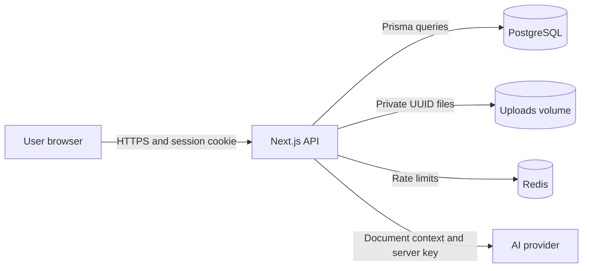

# Security Policy — AI PDF Learning Platform

Last reviewed: 2026-08-25

## Scope and Trust Boundary

ระบบประกอบด้วย Next.js UI/Route Handlers, NextAuth JWT, Prisma/PostgreSQL, Redis rate limiting, private PDF storage และ external AI providers



Browser และ AI provider อยู่นอก Trusted Application Boundary ทุก Route Handler ต้องตรวจ Authentication และ Ownership ใกล้ข้อมูลจริง ไม่พึ่งการซ่อนเมนูหรือ Proxy เพียงอย่างเดียว

## Authentication and RBAC

- Login ใช้ NextAuth Credentials Provider และ `bcryptjs` cost factor 12
- Login ผิดบันทึก `LoginLog`; ครบ 5 ครั้งจะ lock บัญชี 30 วินาที
- Session ใช้ JWT อายุ 30 วัน; production cookie ตั้ง `httpOnly`, `sameSite=lax`, `secure`
- Role ปัจจุบันคือ `STUDENT` และ `ADMIN`
- `/admin` และ `/api/admin/*` ตรวจ `ADMIN` ฝั่ง Server และตอบ `403 Forbidden`
- Document, Message และ LearningTool ตรวจ `userId` ownership ทุกครั้ง

## File Upload Security

- รับเฉพาะ `.pdf` และ MIME `application/pdf`
- จำกัดขนาด 10 MB และตรวจ magic bytes `%PDF`
- เปลี่ยนชื่อเป็น UUID และเก็บนอก `public/` ใน private uploads volume
- ตรวจ UUID allowlist และ resolved path containment เพื่อป้องกัน Path Traversal
- ลบ Database records และไฟล์ PDF/text/index เมื่อผู้ใช้ลบเอกสาร
- ไฟล์ที่สกัดข้อความไม่ได้จะถูกปฏิเสธและไม่ถูกบันทึก

## AI and Privacy Controls

- API keys อยู่ใน Environment Variables และไม่ส่งไป Browser
- ส่งเอกสารให้ AI หลังตรวจว่า User เป็นเจ้าของเท่านั้น
- Prompt ระบุให้เอกสารเป็น untrusted reference data และไม่ทำตามคำสั่งที่ฝังอยู่ในเอกสาร
- ใช้ข้อมูลจากเอกสารเท่านั้น พร้อม page markers สำหรับ citation
- AI และ Upload endpoints มี Redis rate limiting
- Groq prompt/output ถูกจำกัดเพื่อควบคุม TPM และค่าใช้จ่าย

## Important Controls

| Asset/Threat | Control | Evidence |
|---|---|---|
| Login brute force | bcrypt, failed attempts, lockout, LoginLog | `src/lib/auth.ts` |
| Path traversal | UUID allowlist and path containment | `src/lib/security.ts` |
| IDOR/document disclosure | Server-side owner checks | `src/app/api/files/[filename]/route.ts` |
| Fake/oversized PDF | MIME, extension, signature, 10 MB limit | `src/app/api/upload/route.ts` |
| AI cost/DoS | Redis rate limit and prompt limits | `src/proxy.ts`, `src/lib/ai-provider.ts` |
| Prompt injection | Delimited document and grounding rules | `src/app/api/ai/route.ts`, `src/app/api/tools/route.ts` |
| Session theft | HttpOnly/SameSite/Secure cookie and expiry | `src/lib/auth.ts` |

## Important Endpoints

| Endpoint | Required control |
|---|---|
| `POST /api/auth/register` | Server validation; new users are `STUDENT` |
| `POST /api/auth/callback/credentials` | bcrypt verification, lockout and login log |
| `POST /api/upload` | Session, size/MIME/signature/path checks |
| `GET /api/files` | Session and `userId` filter |
| `GET/PATCH/DELETE /api/files/[filename]` | UUID and Owner/Admin authorization |
| `POST /api/ai` | Session, owner document lookup and rate limit |
| `POST /api/tools` | Session, owner document lookup and provider selection |
| `GET /api/admin/overview` | 401 unauthenticated, 403 non-Admin |

## Secure SDLC Evidence

| Stage | Evidence |
|---|---|
| Requirement | PDF-only, private ownership, AI privacy and deletion requirements |
| Design | Trust boundaries, RBAC, ownership checks and Redis rate limit |
| Development | bcrypt, Prisma queries, UUID storage, `.env` secrets |
| Testing | `bun run test`, `bun run test:security`, lint and integration tests |
| Deployment | Docker PostgreSQL/Redis, private uploads volume, required `NEXTAUTH_SECRET` |
| Maintenance | Login logs, dependency updates, patch review and incident response |

## Verification Checklist

```powershell
bun run lint
bun run test
bun run test:security
bun run build
docker compose ps
```

Manual release checks:

1. Student reads only their own PDF.
2. Student receives `403` from `/api/admin/overview` and cannot open `/admin`.
3. Five invalid passwords trigger temporary lockout.
4. `.exe`, fake-MIME PDF and files over 10 MB are rejected.
5. `../package.json` cannot escape uploads storage.
6. Absent/expired session receives `401` or redirects to `/login`.

## Secret Management

Never commit `.env`, `NEXTAUTH_SECRET`, Admin/Student passwords, AI API keys, database credentials or `uploads/`. Rotate all affected secrets immediately if exposed. Production should use a dedicated PostgreSQL application user instead of the Docker development `postgres` superuser.

## Incident Response

1. Disable the affected endpoint or AI provider.
2. Preserve logs without secrets or document contents.
3. Rotate API keys, `NEXTAUTH_SECRET`, database credentials and account passwords.
4. Identify affected users/documents and remove exposed artifacts where required.
5. Patch the cause and run the complete security suite.
6. Notify affected users if private data may have been exposed.
7. Add a regression test before re-enabling the service.

## Reporting a Vulnerability

Do not open a public issue for a suspected vulnerability. Send a private report to the project maintainer with impact, reproduction steps, affected endpoint/file, environment, suggested mitigation and any exposure details. Do not include real API keys, passwords or private PDF contents.
