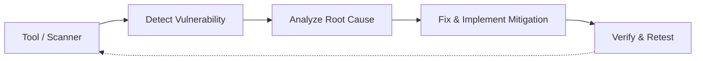

# รายงานความมั่นคงปลอดภัยและความคืบหน้าโครงการ (DevSecOps Security Progress Report)
**รายวิชา:** DevSecOps  
**หัวข้อ:** การประเมินความเสี่ยงและการวิเคราะห์จุดอ่อนของเว็บแอปพลิเคชัน  
**โครงการ:** AI PDF Learning Platform (AI Study Companion / AgentAI)  
**กลุ่ม:** Group 2  
**วันที่จัดทำ:** กันยายน 2026  
**GitHub Repository:** [github.com/HIR0NA/ai-pdf-learning-platform](https://github.com/HIR0NA/ai-pdf-learning-platform)

---

### ภาพรวมระบบ (System Overview)
ระบบ **AI PDF Learning Platform (AgentAI)** เป็นเว็บแอปพลิเคชันสำหรับการเรียนรู้ที่เปิดให้นักศึกษาอัปโหลดเอกสารประกอบการเรียน (PDF) ขนาดสูงสุด 50MB เพื่อวิเคราะห์ สรุปเนื้อหา ถาม-ตอบอัจฉริยะแบบเรียลไทม์ (Contextual Chat Streaming) และสร้างเครื่องมือช่วยทบทวนความจำ (Quiz, Flashcards, Study Schedule) โดยเชื่อมต่อกับ AI Providers (Google Gemini, Groq GPT-OSS 120B และ Qwen) ทั้งนี้ระบบจำเป็นต้องมีมาตรการรักษาความมั่นคงปลอดภัยของข้อมูลส่วนบุคคล เอกสาร และการควบคุมสิทธิ์อย่างรัดกุม

---

## ข้อ 1. การระบุ Asset สำคัญ (Critical Assets)
**สิ่งที่ต้องส่ง/หลักฐาน:** ระบุทรัพยากรสำคัญของระบบ (Web, Database, API, Login, User Data ฯลฯ) พร้อมประเมินผลกระทบหากถูกโจมตี

| ลำดับ | หมวดหมู่ Asset | รายละเอียดและข้อมูลที่เก็บรักษา | ระดับความสำคัญ | การประเมินผลกระทบหากถูกโจมตี |
| :---: | :--- | :--- | :---: | :--- |
| 1 | **User Identity & Data** | ข้อมูลบัญชีผู้ใช้, อีเมล, รหัสผ่าน (Bcrypt Hash Cost 12), Session JWT Token | **Critical** | บัญชีถูกยึดครอง (Account Takeover), การสวมรอยตัวตน หรือถูกยกระดับสิทธิ์ |
| 2 | **Private Stored PDFs** | ไฟล์เอกสารต้นฉบับของผู้ใช้ที่จัดเก็บในไดเรกทอรี `uploads/` | **Critical** | ข้อมูลเอกสารการเรียน ข้อสอบ หรือเอกสารลับรั่วไหลสู่สาธารณะ (Data Breach) |
| 3 | **Database (PostgreSQL)** | ฐานข้อมูลตาราง `User`, `Document`, `Message`, `LearningTool`, `LoginLog` | **Critical** | ข้อมูลทั้งระบบถูกขโมย ลบ หรือแก้ไขผ่านการโจมตี SQL Injection |
| 4 | **AI API Keys** | คีย์ลับ `GEMINI_API_KEY`, `GROQ_API_KEY`, `BAZAARLINK_API_KEY` | **High** | กุญแจ API รั่วไหล นำไปสู่การแอบใช้โควตาจนเกิดค่าใช้จ่ายมหาศาล (Denial of Wallet) |
| 5 | **Web & API Server** | Next.js 16 Framework, Turbopack Engine, Edge Proxy และ API Route Handlers | **High** | เซิร์ฟเวอร์ล่มจากการถูกโจมตี DoS หรือถูกรันโค้ดอันตรายควบคุมเซิร์ฟเวอร์ (RCE) |

---

## ข้อ 2. การวิเคราะห์ Attack Surface (Attack Surface Analysis)
**สิ่งที่ต้องส่ง/หลักฐาน:** วิเคราะห์จุดที่ผู้โจมตีสามารถเข้าถึงระบบได้ เช่น Login, Form, API, Upload

1. **Authentication Endpoints (`/login`, `/register`, `/api/auth/*`):**  
   - ช่องทางรับ Username, Email และ Password ผ่าน Web Form  
   - มีความเสี่ยงต่อ Password Brute-force, Credential Stuffing, Session Fixation และ SQL Injection
2. **Document Upload API (`/api/upload`):**  
   - จุดรับส่งไฟล์ Multipart Form Data ขนาดสูงสุด 50MB  
   - มีความเสี่ยงต่อ Arbitrary File Upload (การอัปโหลดไฟล์ Shell/Script), File Path Traversal (`../../`) และ Fake MIME Injection
3. **Document Access & Storage API (`/api/files/[filename]`):**  
   - ช่องทางเรียกดู ดาวน์โหลด และลบไฟล์ PDF ตามชื่อไฟล์  
   - มีความเสี่ยงต่อ Insecure Direct Object References (IDOR / BOLA) ที่ผู้ใช้งานอาจพยายามเข้าถึงไฟล์ของผู้อื่นโดยไม่ได้รับอนุญาต
4. **AI Generation & Processing Endpoints (`/api/ai`, `/api/tools`):**  
   - ช่องทางการรับ User Prompt และคำสั่งสร้างเครื่องมือการเรียนรู้  
   - มีความเสี่ยงต่อ Prompt Injection, Resource Exhaustion (DoS) และ Rate Limiter Bypass ผ่านการปลอมแปลง Header IP
5. **Admin Console & Management API (`/admin`, `/api/admin/*`):**  
   - ช่องทางดูสถิติระบบและตรวจสอบ Audit Log สำหรับผู้ดูแลระบบ  
   - มีความเสี่ยงต่อ Broken Access Control และ Privilege Escalation หากขาดการตรวจสอบสิทธิ์ระดับ Server-Side

---

## ข้อ 3. การวิเคราะห์ Threat (Threat Analysis - อ้างอิง OWASP Top 10)
**สิ่งที่ต้องส่ง/หลักฐาน:** ระบุและวิเคราะห์ภัยคุกคามอย่างน้อย 5 Threats พร้อมอ้างอิงมาตรฐาน OWASP Top 10 (ในระบบนี้วิเคราะห์ครอบคลุม 8 Threats)

1. **Threat 1: Arbitrary File Upload & Path Traversal (OWASP A01:2021 - Broken Access Control & A04:2021 - Insecure Design)**  
   ผู้โจมตีส่งไฟล์สคริปต์อันตรายหรือส่งชื่อไฟล์ที่มีอักขระ `../` เพื่อเขียนทับไฟล์ระบบ เช่น `../../package.json` ส่งผลให้แอปพลิเคชันพังหรือเกิด Remote Code Execution (RCE)
2. **Threat 2: Broken Object Level Authorization / IDOR (OWASP A01:2021 - Broken Access Control)**  
   ผู้โจมตีทำการสุ่มหรือเปลี่ยนพารามิเตอร์ชื่อไฟล์ใน URL `/api/files/{filename}` เพื่อดาวน์โหลดเอกสาร PDF ของผู้ใช้อื่น ทำให้เกิดข้อมูลรั่วไหลข้ามบัญชี
3. **Threat 3: Privilege Escalation on Admin Endpoints (OWASP A01:2021 - Broken Access Control)**  
   ผู้ใช้ทั่วไป (Role: Student) ทำการยิงคำขอ HTTP ตรงไปยัง `/api/admin/overview` เพื่อดูข้อมูลสถิติหรือจัดการผู้ใช้ทั้งหมด เนื่องจากระบบซ่อนเพียงปุ่มบน UI แต่ไม่ได้ตรวจสิทธิ์หลังบ้าน
4. **Threat 4: Password Brute-Force & Credential Stuffing (OWASP A07:2021 - Identification & Authentication Failures)**  
   ผู้โจมตีใช้โปรแกรมยิงสุ่มรหัสผ่านผ่านแบบฟอร์มล็อกอินซ้ำๆ อย่างไม่จำกัดจำนวนครั้ง จนสามารถคาดเดารหัสผ่านของผู้ใช้งานได้สำเร็จ
5. **Threat 5: Rate Limiter Bypass via IP Spoofing (OWASP A04:2021 - Insecure Design)**  
   ผู้โจมตีสลับค่า Header `X-Forwarded-For` ปลอมใน Request เพื่อหลบหลีกการจำกัดความถี่ในการเรียกใช้ AI API ส่งผลให้เซิร์ฟเวอร์และโควตา AI ถูกใช้จนหมดสิ้น (Denial of Service & Denial of Wallet)
6. **Threat 6: Session Hijacking & Missing Cookie Security Flags (OWASP A07:2021 - Identification & Authentication Failures)**  
   Session Cookie ที่ส่งผ่านเครือข่ายไม่มีการระบุค่า `HttpOnly` หรือ `Secure` เสี่ยงต่อการถูกขโมยผ่าน Cross-Site Scripting (XSS) หรือ Man-in-the-Middle (MitM)
7. **Threat 7: SQL Injection via Parameterized Inputs (OWASP A03:2021 - Injection)**  
   ผู้ไม่หวังดีแทรกคำสั่ง SQL เข้ามาในช่องค้นหาหรือฟอร์มล็อกอินเพื่อข้ามขั้นตอนยืนยันตัวตนหรือดึงข้อมูลทั้งฐานข้อมูล
8. **Threat 8: Vulnerabilities in Third-Party Dependencies (OWASP A06:2021 - Vulnerable & Outdated Components)**  
   Library ภายนอกมีช่องโหว่ความปลอดภัย เช่น แพ็กเกจ `browserslist` ที่อาจถูกโจมตีแบบ Unbounded Memory Growth (DoS)

---

## ข้อ 4. การประเมิน Risk (Risk Assessment)
**สิ่งที่ต้องส่ง/หลักฐาน:** คำนวณความเสี่ยงด้วยสูตร **Likelihood (1–5) × Impact (1–5)** และจัดระดับ Low, Medium, High, Critical

### เกณฑ์การให้คะแนนและจัดระดับความเสี่ยง
* **โอกาสเกิด (Likelihood - L):** 1 (ยากมาก) ถึง 5 (เกิดได้ง่ายมาก/มีเครื่องมือสำเร็จรูป)
* **ผลกระทบ (Impact - I):** 1 (น้อยมาก) ถึง 5 (รุนแรงสูงสุด/ระบบล่ม/ข้อมูลลับรั่วไหล)
* **ระดับความเสี่ยง (Risk Score = L × I):**
  - 🟢 **Low (1–6):** ความเสี่ยงต่ำ แก้ไขตามรอบปกติ
  - 🟡 **Medium (8–12):** ความเสี่ยงปานกลาง มีแผนควบคุมความเสี่ยง
  - 🟠 **High (14–19):** ความเสี่ยงสูง ต้องเร่งแก้ไขทันที
  - 🔴 **Critical (20–25):** ความเสี่ยงวิกฤต บล็อกการปล่อยระบบจนกว่าจะแก้ไข

### ตารางทะเบียนความเสี่ยง (Risk Register)
| รหัส | Asset | Threat / Vulnerability | L (1-5) | I (1-5) | Risk Score | ระดับ Risk | แนวทางแก้ไข (Mitigation) | สถานะ |
| :-: | :--- | :--- | :-: | :-: | :-: | :---: | :--- | :---: |
| **R01** | Upload API | Arbitrary File Upload & Path Traversal (OWASP A01/A04) | 4 | 5 | 20 | **Critical** | ตรวจ Magic Bytes `%PDF-`, สุ่มชื่อ UUID v4, กักบริเวณ Path | **Fixed** |
| **R02** | Files API | Broken Object Level Authorization (IDOR) (OWASP A01) | 4 | 5 | 20 | **Critical** | ตรวจ Server-side Session & Document Ownership (`userId`) | **Fixed** |
| **R03** | Admin API | Privilege Escalation / Broken Access Control (OWASP A01) | 4 | 5 | 20 | **Critical** | บังคับใช้ Edge Proxy Guard & Route Guard ตอบกลับ 403 Forbidden | **Fixed** |
| **R04** | Login | Password Brute-force & Credential Stuffing (OWASP A07) | 4 | 4 | 16 | **High** | นับ `failedAttempts`, ล็อกบัญชี 30 วินาทีเมื่อผิด 5 ครั้ง, บันทึก Log | **Fixed** |
| **R05** | AI API | Rate Limiter Bypass ผ่าน IP Spoofing (OWASP A04) | 3 | 4 | 12 | **Medium** | ตรวจ Trusted Proxy Policy + Token Bucket In-Memory Limiter | **Fixed** |
| **R06** | Session | Session Hijacking & Missing Cookie Flags (OWASP A07) | 3 | 4 | 12 | **Medium** | กำหนด Cookie Flag `httpOnly: true`, `sameSite: "lax"`, `secure: true` | **Fixed** |
| **R07** | Database | SQL Injection ผ่าน Input Form/API (OWASP A03) | 2 | 5 | 10 | **Medium** | บังคับใช้ Prisma ORM Parameterized Prepared Statements 100% | **Fixed** |
| **R08** | Packages | Vulnerable Dependency ใน `browserslist` (OWASP A06) | 3 | 3 | 9 | **Medium** | ใช้ Software Composition Analysis `npm audit` และรัน `npm audit fix` | **Fixed** |

---

## ข้อ 5. การประเมินจุดอ่อน (Vulnerability Assessment - ผลจากการตรวจสอบระบบจริง)
**สิ่งที่ต้องส่ง/หลักฐาน:** ผลจากการตรวจสอบระบบจริงด้วยเครื่องมือทดสอบความมั่นคงปลอดภัยตามวงรอบ DevSecOps (**Tool → Detect → Analyze → Fix**)



### 1. เครื่องมือ: Dependency Scanner (`npm audit`)
- **Tool:** `npm audit` (Software Composition Analysis - SAST)
- **Detect:** สแกนพบช่องโหว่ระดับ High Severity ใน Package `browserslist` (`<=4.28.6`)
- **Analyze:** เกิดจาก Unbounded Memory Growth (Denial of Service) ขณะทำ Regular Expression Matching ระหว่าง Build
- **Fix:** ดำเนินการอัปเดต Dependency Tree ด้วยคำสั่ง `npm audit fix`
- **ผลหลังตรวจสอบจริง:** สแกนซ้ำยืนยันผลลัพธ์เป็น **found 0 vulnerabilities** (หลักฐานใน [npm-audit-report.md](file:///evidence/sast/npm-audit-report.md))

### 2. เครื่องมือ: Dynamic Application Security Testing (`Burp Suite`)
- **Tool:** Burp Suite Professional / Community Edition (DAST)
- **Detect:** จำลองการยิง Request เข้าหา `/api/admin/overview` ด้วย Token ของนักศึกษา (Role: `STUDENT`)
- **Analyze:** ระบบเดิมไม่มีการตรวจสอบ Role ฝั่ง Server จึงตอบกลับ HTTP 200 OK พร้อมข้อมูลสถิติของแอดมินทั้งหมด
- **Fix:** เขียน Guard ตรวจสอบ `isAdmin(session.user.role)` และปฏิเสธด้วย HTTP 403 Forbidden ทันที
- **ผลหลังตรวจสอบจริง:** ยิง Request ซ้ำ ระบบตอบกลับ **HTTP 403 Forbidden** อย่างถูกต้อง (หลักฐานใน [admin-rbac-403.txt](file:///evidence/burpsuite/admin-rbac-403.txt))

### 3. เครื่องมือ: Vulnerability Scanner (`OWASP ZAP Baseline Scan`)
- **Tool:** OWASP ZAP (Zed Attack Proxy)
- **Detect:** ตรวจพบการขาดหายไปของ Security Response Headers และ Cookie Security Flags
- **Analyze:** ส่งผลให้แอปพลิเคชันเสี่ยงต่อการถูกโจมตีแบบ Clickjacking, MIME Confusion และ Cookie Theft
- **Fix:** กำหนด Security Headers ครบถ้วนใน `next.config.ts` และปรับ NextAuth Session Cookie ให้มี `httpOnly`, `sameSite: "lax"`, `secure: true`
- **ผลหลังตรวจสอบจริง:** ผลสแกนซ้ำรายงานว่า Headers ครบถ้วนและ Cookies ถูกต้องตามมาตรฐาน (หลักฐานใน [zap-scan-report.md](file:///evidence/zap/zap-scan-report.md))

### 4. เครื่องมือ: Automated Security Unit Testing (`Node Native Test Runner`)
- **Tool:** Node.js Security Test Runner (`tests/security.test.ts`, `tests/rbac.test.ts`)
- **Detect & Verify:** ทดสอบการกักบริเวณ Path Traversal, ป้องกัน IP Spoofing, อัปโหลดไฟล์เกินขนาด (HTTP 413) และสิทธิ์ RBAC
- **ผลหลังตรวจสอบจริง:** ผ่านการทดสอบทั้งหมด **10/10 Test Cases (100% Pass Rate)** ป้องกันการเกิด Regression เมื่อมีการแก้ไขโค้ด

---

## ข้อ 6. การวิเคราะห์ช่องโหว่ (Vulnerability Analysis)
**สิ่งที่ต้องส่ง/หลักฐาน:** แจกแจงว่าช่องโหว่คืออะไร เกิดที่ส่วนใด และมีผลกระทบอย่างไร

### จุดอ่อนที่ 1: การอัปโหลดไฟล์ไม่ตรวจสอบเนื้อหาจริงและเสี่ยง Path Traversal
* **ช่องโหว่คืออะไร:** ระบบในเวอร์ชันแรกเชื่อถือชื่อไฟล์ (`file.name`) และ Content-Type ที่ Client ส่งมาโดยตรง และนำชื่อไฟล์ไปต่อเข้ากับ Path ปลายทาง
* **เกิดที่ส่วนใด:** ไฟล์ `src/app/api/upload/route.ts`
* **มีผลกระทบอย่างไร:** ผู้โจมตีสามารถอัปโหลดไฟล์ Shell สคริปต์ หรือส่งชื่อไฟล์เป็น `../../package.json` เพื่อทำลายหรือเขียนทับไฟล์ระบบ ก่อให้เกิด Remote Code Execution (RCE) และบริการล่ม

### จุดอ่อนที่ 2: การเข้าถึงหน้าและ API ของผู้ดูแลระบบโดยไม่มีการตรวจสิทธิ์หลังบ้าน (Broken Access Control)
* **ช่องโหว่คืออะไร:** ระบบซ่อนเพียงปุ่มลิงก์บน Navbar แต่ Endpoint `/api/admin/overview` ไม่ได้ตรวจสอบ Role ของผู้ใช้จาก Session Token
* **เกิดที่ส่วนใด:** ไฟล์ `src/components/Navbar.tsx` และ `src/app/api/admin/overview/route.ts`
* **มีผลกระทบอย่างไร:** ผู้ใช้งานทั่วไป (Student) สามารถยิง API ตรงเพื่อดูสถิติระบบ บัญชีผู้ใช้ทั้งหมด และประวัติการเข้าใช้งาน เกิด Privilege Escalation

### จุดอ่อนที่ 3: ไม่มีระบบหน่วงเวลาและล็อกบัญชีเมื่อกรอกรหัสผ่านผิด (Lack of Account Lockout)
* **ช่องโหว่คืออะไร:** ฟังก์ชันตรวจสอบการยืนยันตัวตนไม่มีตัวนับความล้มเหลวในการกรอกรหัสผ่านผิด
* **เกิดที่ส่วนใด:** ไฟล์ `src/app/api/auth/[...nextauth]/route.ts`
* **มีผลกระทบอย่างไร:** ผู้โจมตีสามารถรันบอตหรือโปรแกรม Brute-force ยิงรหัสผ่านได้เป็นหมื่นครั้งอย่างต่อเนื่องจนกว่าจะสุ่มเจอรหัสผ่านที่ถูกต้อง

### จุดอ่อนที่ 4: การจำกัดคำขอพึ่งพา Header ปลอมแปลงได้ (Rate Limiter Bypass via IP Spoofing)
* **ช่องโหว่คืออะไร:** ระบบอ่านค่า Client IP จาก Header `X-Forwarded-For` โดยไม่ตรวจสอบว่าเป็น Trusted Proxy หรือไม่
* **เกิดที่ส่วนใด:** ไฟล์ `src/proxy.ts` (Edge Proxy Rate Limiter)
* **มีผลกระทบอย่างไร:** ผู้โจมตีสามารถสุ่มเปลี่ยน IP ใน Header ไปเรื่อยๆ เพื่อหลบเลี่ยง Token-Bucket Limiter ทำให้สามารถยิงคำขอ DoS หรือผลาญโควตา AI ได้ไม่จำกัด

---

## ข้อ 7. แนวทางแก้ไข (Mitigation / Remediation)
**สิ่งที่ต้องส่ง/หลักฐาน:** อธิบายวิธีการแก้ไข ป้องกัน และลดความเสี่ยงที่ได้ดำเนินการจริง

1. **มาตรการแก้ไขระบบอัปโหลดไฟล์ (File Security):**
   - ตรวจสอบไบต์ตั้งต้นของไฟล์จริง (**Magic Bytes**) 4 ไบต์แรก (`%PDF-` หรือ `0x25 0x50 0x44 0x46`) ไม่เชื่อถือเพียงนามสกุลหรือ Content-Type
   - สุ่มสร้างชื่อไฟล์ใหม่ด้วย `crypto.randomUUID()` เสมอ เพื่อตัดชื่อไฟล์เดิมของผู้ใช้ออกทั้งหมด
   - ใช้ฟังก์ชัน `resolveStoredDocumentPaths` กักบริเวณ Path ไม่ให้ออกนอกโฟลเดอร์ `uploads/`
2. **มาตรการแก้ไขการควบคุมสิทธิ์ (Role-Based Access Control - RBAC):**
   - วางแนวป้องกัน 2 ชั้น (Two-Tier Defense): ชั้นที่ 1 ติดตั้ง Edge Proxy Guard ใน `src/proxy.ts` และชั้นที่ 2 ติดตั้ง Server Route Guard ใน Handler ทุกตัว
   - ตรวจสอบบทบาทจาก Signed JWT Session เสมอ หากไม่ใช่ `ADMIN` ให้ตอบกลับด้วย `HTTP 403 Forbidden`
3. **มาตรการป้องกันการเดารหัสผ่าน (Anti-Brute Force & Lockout):**
   - เพิ่มฟิลด์ `failedAttempts` และ `lockedUntil` ในฐานข้อมูล
   - หากกรอกรหัสผ่านผิดติดต่อกันครบ 5 ครั้ง ระบบจะสั่งล็อกบัญชีทันที 30 วินาที
   - เพิ่มตาราง `LoginLog` เพื่อบันทึก IP, Timestamp และผลลัพธ์ สำหรับการตรวจสอบย้อนหลัง (Audit Trail)
4. **มาตรการป้องกันการปลอมแปลง IP และจำกัดอัตราคำขอ (Rate Limiting & Anti-Spoofing):**
   - อนุญาตให้อ่าน Header `X-Forwarded-For` เฉพาะกรณีที่มีการกำหนด `TRUSTED_PROXIES` เท่านั้น หากไม่มีให้ใช้ Direct Socket IP
   - ปรับใช้ Token Bucket Rate Limiter ในระดับ Proxy เพื่อควบคุมอัตราการเรียกใช้ API ของแต่ละ Client
5. **มาตรการด้าน Security Headers & Cookie Security:**
   - ตั้งค่า Content-Security-Policy (CSP), X-Content-Type-Options: nosniff, X-Frame-Options: DENY ใน `next.config.ts`
   - กำหนดให้ NextAuth Cookie มีแฟลก `httpOnly: true`, `sameSite: "lax"`, `secure: true` ในระดับ Production

---

## ข้อ 8. การแสดงหลักฐานก่อนแก้และหลังแก้ (Before / After Evidence)
**สิ่งที่ต้องส่ง/หลักฐาน:** แสดงหลักฐานก่อนแก้และหลังแก้ อย่างน้อย 2 จุด (ในระบบนี้จัดทำหลักฐานครบถ้วนถึง **4 จุด**)

### ตารางสรุปการเปรียบเทียบ Before / After
| จุดที่ | มาตรการความปลอดภัย | ก่อนแก้ไข (Before / Vulnerable) | หลังแก้ไข (After / Secured) | ลิงก์หลักฐานเชิงลึก |
| :-: | :--- | :--- | :--- | :---: |
| **1** | **File Upload & Path Traversal** | เชื่อถือ `file.name` นำไปต่อ Path โดยตรง ไม่ตรวจเนื้อหา | ตรวจ Magic Bytes `%PDF-`, เปลี่ยนชื่อเป็น UUID v4, กักบริเวณ Path | [ดูไฟล์หลักฐาน](file:///evidence/before-after/point-1-path-traversal-upload.md) |
| **2** | **ระบบควบคุมสิทธิ์แอดมิน (RBAC)** | ซ่อนเฉพาะปุ่มที่หน้าจอ UI แต่ API เปิดโล่งให้ยิงตรงได้ | ติดตั้ง Edge Proxy Guard + Server Route Guard คืนค่า 403 ทันที | [ดูไฟล์หลักฐาน](file:///evidence/before-after/point-2-admin-rbac-authorization.md) |
| **3** | **ระบบป้องกันรหัสผ่าน (Brute-Force)** | ผู้ใช้สามารถเดารหัสผ่านซ้ำได้ไม่จำกัดครั้ง ไม่มีการล็อกบัญชี | นับ `failedAttempts` ผิด 5 ครั้งล็อกบัญชี 30 วินาที + บันทึก `LoginLog` | [ดูไฟล์หลักฐาน](file:///evidence/before-after/point-3-brute-force-lockout.md) |
| **4** | **จำกัดคำขอ & ป้องกัน IP Spoofing** | เชื่อถือ `X-Forwarded-For` ปลอม ทำให้สลับ IP หลบ Rate Limit ได้ | ตรวจสอบ Trusted Proxy Policy + Token Bucket Rate Limiter | [ดูไฟล์หลักฐาน](file:///evidence/before-after/point-4-idor-and-rate-limiting.md) |

---

### รายละเอียดเปรียบเทียบโค้ดแต่ละจุด (Code Diff Comparison)

#### จุดที่ 1: การอัปโหลดไฟล์ & ป้องกัน Path Traversal
```typescript
// ❌ ก่อนแก้ไข (Vulnerable - เชื่อถือชื่อไฟล์จาก Client โดยตรง)
export async function POST(req: Request) {
  const formData = await req.formData();
  const file = formData.get('file') as File;
  // ตรวจสอบเฉพาะ MIME ที่ Client ส่งมา
  if (file.type !== 'application/pdf') return NextResponse.json({ error: 'Not PDF' }, { status: 400 });
  // นำชื่อไฟล์จาก Client ไปต่อ Path ทันที -> เสี่ยงต่อ Path Traversal เช่น "../../package.json"
  const filePath = path.join(process.cwd(), 'uploads', file.name);
  await fs.writeFile(filePath, Buffer.from(await file.arrayBuffer()));
}
```
```typescript
// ✅ หลังแก้ไข (Secured - ตรวจ Magic Bytes + สุ่ม UUID v4 + กักบริเวณ Path)
export async function POST(req: Request) {
  const formData = await req.formData();
  const file = formData.get('file') as File;
  const buffer = Buffer.from(await file.arrayBuffer());

  // 1. ตรวจสอบ Magic Bytes 4 ไบต์แรก (%PDF- / 0x25 0x50 0x44 0x46)
  const isRealPdf = buffer.length >= 4 && buffer[0] === 0x25 && buffer[1] === 0x50 && buffer[2] === 0x44 && buffer[3] === 0x46;
  if (!isRealPdf) return NextResponse.json({ error: 'Invalid PDF content (Magic Bytes Mismatch)' }, { status: 400 });

  // 2. สุ่มชื่อไฟล์ใหม่เป็น UUID v4 เสมอ
  const safeFilename = `${crypto.randomUUID()}.pdf`;
  // 3. ใช้ resolveStoredDocumentPaths กักบริเวณ Path ให้ปลอดภัย
  const { pdfPath } = resolveStoredDocumentPaths(safeFilename);
  await fs.writeFile(pdfPath, buffer);
}
```

#### จุดที่ 2: ระบบควบคุมสิทธิ์เข้าถึงของผู้ดูแลระบบ (Admin RBAC)
```tsx
// ❌ ก่อนแก้ไข (Vulnerable - ซ่อนปุ่มเฉพาะที่หน้าจอ แต่ Route API ไม่มี Guard)
// src/components/Navbar.tsx
{session?.user.role === 'ADMIN' && (
  <Link href="/admin">Admin Console</Link>
)}

// src/app/api/admin/overview/route.ts
export async function GET() {
  // ไม่มี Server Guard นักเรียนสามารถยิง GET /api/admin/overview ได้ข้อมูลแอดมินทันที
  const stats = await getSystemStats();
  return NextResponse.json(stats);
}
```
```typescript
// ✅ หลังแก้ไข (Secured - ป้องกัน 2 ชั้นทั้ง Edge Proxy และ Server Route Handler)
// 1. src/proxy.ts (Edge Proxy Guard)
if (pathname.startsWith('/api/admin')) {
  if (token?.role !== 'ADMIN') {
    return NextResponse.json({ error: 'Forbidden: Admin privilege required' }, { status: 403 });
  }
}

// 2. src/app/api/admin/overview/route.ts (Server Route Handler)
export async function GET() {
  const session = await getServerSession(authOptions);
  if (!session || !isAdmin(session.user.role)) {
    return NextResponse.json({ error: 'Forbidden' }, { status: 403 });
  }
  const stats = await getSystemStats();
  return NextResponse.json(stats);
}
```

#### จุดที่ 3: ระบบป้องกันการเดารหัสผ่าน (Brute-Force Attack & Account Lockout)
```typescript
// ❌ ก่อนแก้ไข (Vulnerable - ไม่มีตัวนับความล้มเหลว สามารถยิงเดารหัสผ่านได้ไม่จำกัด)
async authorize(credentials) {
  const user = await prisma.user.findUnique({ where: { email: credentials.email } });
  if (!user) return null;
  const isValid = await bcrypt.compare(credentials.password, user.password);
  if (!isValid) return null; // ส่งกลับ null ทันที ยิงซ้ำได้ตลอดเวลา
  return user;
}
```
```typescript
// ✅ หลังแก้ไข (Secured - ล็อกบัญชี 30 วินาที เมื่อกรอกรหัสผ่านผิดครบ 5 ครั้ง พร้อม Audit Log)
async authorize(credentials) {
  const user = await prisma.user.findUnique({ where: { email: credentials.email } });
  if (!user) return null;

  // ตรวจสอบเวลาที่ถูกล็อก
  if (user.lockedUntil && user.lockedUntil > new Date()) {
    const remaining = Math.ceil((user.lockedUntil.getTime() - Date.now()) / 1000);
    throw new Error(`LOCKED:${remaining}`);
  }

  const isValid = await bcrypt.compare(credentials.password, user.password);
  if (!isValid) {
    const newAttempts = user.failedAttempts + 1;
    const shouldLock = newAttempts >= 5;
    await prisma.user.update({
      where: { id: user.id },
      data: {
        failedAttempts: shouldLock ? 0 : newAttempts,
        lockedUntil: shouldLock ? new Date(Date.now() + 30 * 1000) : null,
      },
    });
    await prisma.loginLog.create({ data: { email: user.email, ip: clientIp, success: false } });
    throw new Error(shouldLock ? 'LOCKED:30' : 'INVALID_CREDENTIALS');
  }

  // รีเซ็ตตัวนับเมื่อเข้าสู่ระบบสำเร็จ
  await prisma.user.update({ where: { id: user.id }, data: { failedAttempts: 0, lockedUntil: null } });
  await prisma.loginLog.create({ data: { email: user.email, ip: clientIp, success: true } });
  return user;
}
```

---

## ภาคผนวก 1: โครงสร้างโฟลเดอร์หลักฐาน (Evidence Directory Structure)
ไฟล์หลักฐานจริงทั้งหมดถูกจัดเก็บไว้ในโปรเจกต์ตามโครงสร้างที่อาจารย์กำหนด:

```text
ai-pdf-learning-platform/
├── SECURITY_PROGRESS.md                  # รายงานสรุปฉบับทางการบน GitHub
├── DevSecOps_Security_Progress_Report.html # ไฟล์รายงานฉบับจัดหน้า A4 สำหรับพิมพ์ส่งเป็น PDF
├── evidence/
│   ├── zap/
│   │   └── zap-scan-report.md           # รายงาน Alert และการตั้งค่า Security Headers จาก OWASP ZAP
│   ├── burpsuite/
│   │   ├── admin-rbac-403.txt           # หลักฐาน Request/Response ตรวจจับ RBAC ด้วย Burp Suite
│   │   ├── idor-document-tampering.txt  # หลักฐานการบล็อก IDOR เข้าถึงเอกสารข้าม User
│   │   └── fake-pdf-magic-bytes.txt     # หลักฐานการบล็อกไฟล์ปลอมแปลงด้วย Magic Bytes
│   ├── sast/
│   │   └── npm-audit-report.md          # ผลสแกน npm audit ก่อน/หลังแก้ และ Security Unit Tests
│   ├── database/
│   │   └── db-security-analysis.md      # วิเคราะห์ Prepared Statements, Bcrypt และ LoginLog
│   └── before-after/
│       ├── point-1-path-traversal-upload.md      # เปรียบเทียบโค้ดจุดที่ 1
│       ├── point-2-admin-rbac-authorization.md   # เปรียบเทียบโค้ดจุดที่ 2
│       ├── point-3-brute-force-lockout.md        # เปรียบเทียบโค้ดจุดที่ 3
│       └── point-4-idor-and-rate-limiting.md     # เปรียบเทียบโค้ดจุดที่ 4
└── src/
```

---

## ภาคผนวก 2: โครงร่างบทพูดสำหรับ Demo Video (5–8 นาที)

```text
[นาทีที่ 0:00 - 1:00] แนะนำตัวและภาพรวมระบบ
- แนะนำชื่อกลุ่ม (Group 2) และภาพรวมของระบบ AI PDF Learning Platform
- เปิดหน้าเว็บจริง (Landing Page และ Dashboard) แสดงการทำงานพื้นฐาน

[นาทีที่ 1:00 - 2:30] แสดงเครื่องมือและจุดอ่อนที่พบ (Tools & Detection)
- เปิดหน้า Burp Suite / Terminal แสดงการจำลองการโจมตี
- จุดอ่อนที่ 1: การพยายามเข้าถึงหน้า Admin ด้วยสิทธิ์ Student
- จุดอ่อนที่ 2: การพยายามอัปโหลดไฟล์ Executable ปลอมนามสกุล .pdf หรือชื่อ Path Traversal

[นาทีที่ 2:30 - 5:00] แสดงการแก้ไขใน Source Code (Remediation)
- เปิดโค้ด src/proxy.ts และ src/app/api/upload/route.ts ใน VS Code
- อธิบายวิธีแก้: การตรวจ Magic Bytes, การใช้ UUID v4 และการวาง Server Guard
- แสดงผลการรัน npm audit และการรัน npm test (ผ่านครบ 10/10)

[นาทีที่ 5:00 - 7:00] แสดงผลลัพธ์หลังแก้ไขบนระบบจริง (Verification)
- ทดสอบเข้าถึง Admin ด้วยบัญชี Student -> แสดงหน้า 403 Forbidden
- ทดสอบอัปโหลดไฟล์ที่ไม่ใช่ PDF แท้ -> แสดงแจ้งเตือน Bad Request
- ทดสอบกรอกรหัสผ่านผิด 5 ครั้ง -> แสดงตัวนับถอยหลัง Lockout 30 วินาที

[นาทีที่ 7:00 - 8:00] สรุปผลและกระบวนการ DevSecOps
- สรุปผลการปรับปรุงความปลอดภัย และแผนงานต่อยอดเข้าสู่ CI/CD Security Pipeline ใน Sprint ถัดไป
```
