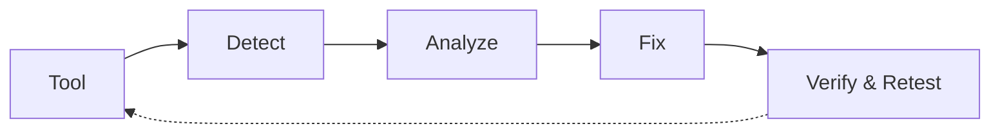

# รายงานความมั่นคงปลอดภัยและความคืบหน้าโครงการ (DevSecOps Security Progress Report)
**รายวิชา:** DevSecOps  
**โครงการ:** AI PDF Learning Platform (AI Study Companion / AgentAI)  
**กลุ่ม:** Group 2  
**สถาบัน:** มหาวิทยาลัยสวนดุสิต (Suan Dusit University)  
**วันที่:** กันยายน 2026

---

## 1. ข้อมูลโครงการและคณะผู้จัดทำ
- **ชื่อระบบ:** AI PDF Learning Platform (AgentAI)
- **วัตถุประสงค์:** แพลตฟอร์มช่วยอ่าน สรุป ถาม-ตอบ สร้างแบบทดสอบ และบัตรคำศัพท์จากเอกสาร PDF ด้วย AI โดยมีระบบแยกสิทธิ์และรักษาความลับของเอกสาร
- **รายชื่อสมาชิกกลุ่ม 2:**
  1. **Papon** — *Lead Developer / Full-stack Developer & DevSecOps Lead* (พัฒนาระบบหลัก, สถาปัตยกรรมความปลอดภัย, RBAC, Data Sanitization และ Pipeline)
  2. **[ชื่อ-นามสกุล สมาชิก 2]** — *Security Testing & QA Engineer* (ทดสอบช่องโหว่ Web Testing / Burp Suite และรวบรวม Evidence)
  3. **[ชื่อ-นามสกุล สมาชิก 3]** — *DevOps & Documentation* (ดูแล Docker Environment, จัดการ Dependency Scan และจัดทำรายงาน)

---

## 2. การประเมินความเสี่ยงและการวิเคราะห์จุดอ่อน (Risk Assessment & Vulnerability Analysis)

### 2.1 การระบุ Asset สำคัญของระบบ (Critical Assets)
| หมวดหมู่ Asset | รายละเอียด Asset | ระดับความสำคัญ | การประเมินผลกระทบหากถูกโจมตี |
| :--- | :--- | :---: | :--- |
| **User Data & Identity** | ข้อมูลบัญชีผู้ใช้, รหัสผ่าน (Bcrypt Hash), Session JWT | **Critical** | บัญชีถูกแฮก, สวมรอยใช้งาน หรือสิทธิ์ถูกยกระดับ |
| **Private Stored PDFs** | เอกสาร PDF ที่ผู้ใช้อัปโหลดเก็บไว้ใน `uploads/` | **Critical** | ข้อมูลเอกสารการเรียนหรือข้อสอบรั่วไหล (Data Breach) |
| **Database (PostgreSQL)** | ตาราง `User`, `Document`, `Message`, `LearningTool`, `LoginLog` | **Critical** | ข้อมูลระบบทั้งหมดถูกแก้ไข ทำลาย หรือขโมยผ่าน SQL Injection |
| **AI Providers & API Keys** | `GEMINI_API_KEY`, `GROQ_API_KEY`, `BAZAARLINK_API_KEY` | **High** | กุญแจ API รั่วไหล นำไปสู่การแอบใช้โควตาจนเกิดค่าใช้จ่ายสูง (Denial of Wallet) |
| **Application & Web Server** | Next.js 16 Web Framework และ API Route Handlers | **High** | เซิร์ฟเวอร์ล่มจากการถูกยิง DoS หรือถูกรันโค้ดอันตราย (RCE) |

### 2.2 การวิเคราะห์พื้นผิวการโจมตี (Attack Surface Analysis)
1. **Authentication Form (`/login`, `/register`):** ช่องทางรับ Username/Password สุ่มเสี่ยงต่อ Brute-force, Credential Stuffing และ SQL Injection
2. **Document Upload API (`/api/upload`):** ช่องทางรับไฟล์ Multipart Form Data ขนาดสูงสุด 50MB สุ่มเสี่ยงต่อ Arbitrary File Upload, File Path Traversal และ Fake MIME Injection
3. **Document Access API (`/api/files/[filename]`):** ช่องทางเรียกดู/ดาวน์โหลด/ลบเอกสาร สุ่มเสี่ยงต่อ Broken Object Level Authorization (BOLA / IDOR)
4. **AI Generation Endpoints (`/api/ai`, `/api/tools`):** ช่องทางประมวลผล LLM สุ่มเสี่ยงต่อ Prompt Injection และ Resource Exhaustion (DoS)
5. **Admin Management (`/admin`, `/api/admin/*`):** ช่องทางบริหารจัดการระบบ สุ่มเสี่ยงต่อ Privilege Escalation และ Missing Function Level Access Control

---

### 2.3 ตารางทะเบียนความเสี่ยง (Risk Register)
> **เกณฑ์การคำนวณความเสี่ยง (Risk Score):** Likelihood (1–5) × Impact (1–5)  
> *ระดับความเสี่ยง:* 1–6 (Low), 8–12 (Medium), 14–19 (High), 20–25 (Critical)

| ID | Asset | Threat / Vulnerability | Likelihood (1-5) | Impact (1-5) | Risk Score | ระดับ Risk | แนวทางแก้ไข (Mitigation) | สถานะ (Status) |
| :-: | :--- | :--- | :-: | :-: | :-: | :---: | :--- | :---: |
| **R01** | Upload API | Arbitrary File Upload & Path Traversal (OWASP A01/A04) | 4 | 5 | 20 | **Critical** | ตรวจ Magic Bytes `%PDF-`, เปลี่ยนชื่อเป็น UUID v4, กักบริเวณ Path | **Fixed** |
| **R02** | Files API | Insecure Direct Object References (IDOR / BOLA) (OWASP A01) | 4 | 5 | 20 | **Critical** | ตรวจสอบ Session และ Server-side Ownership (`userId`) ก่อนส่งไฟล์ | **Fixed** |
| **R03** | Admin API | Broken Access Control / Privilege Escalation (OWASP A01) | 4 | 5 | 20 | **Critical** | บังคับใช้ RBAC ระดับ Proxy และ Route Handler ตอบกลับ 403 Forbidden | **Fixed** |
| **R04** | Login | Password Brute-force & Credential Stuffing (OWASP A07) | 4 | 4 | 16 | **High** | นับ `failedAttempts`, ล็อกบัญชี 30 วินาทีเมื่อผิด 5 ครั้ง, บันทึก `LoginLog` | **Fixed** |
| **R05** | AI API | Rate Limiter Bypass ผ่าน IP Spoofing (OWASP A04) | 3 | 4 | 12 | **Medium** | ไม่เชื่อถือ `X-Forwarded-For` จาก Untrusted Proxy + Token Bucket Limiter | **Fixed** |
| **R06** | Session | Session Hijacking & Credential Sniffing (OWASP A07) | 3 | 4 | 12 | **Medium** | กำหนด Cookie Flag `httpOnly: true`, `sameSite: "lax"`, `secure: true` | **Fixed** |
| **R07** | Database | SQL Injection ผ่านฟอร์มค้นหา/ล็อกอิน (OWASP A03) | 2 | 5 | 10 | **Medium** | ใช้ Prisma ORM บังคับใช้ Parameterized Prepared Statements 100% | **Fixed** |
| **R08** | Packages | Dependency Vulnerability ใน `browserslist` (OWASP A06) | 3 | 3 | 9 | **Medium** | ทำ Software Composition Analysis ด้วย `npm audit` และรัน `npm audit fix` | **Fixed** |

---

## 3. การประเมินและวิเคราะห์ช่องโหว่เชิงลึก (Vulnerability Deep-Dive)

### จุดอ่อนที่ 1: การอัปโหลดไฟล์ไม่ตรวจสอบเนื้อหาจริง (Arbitrary File Upload & Path Traversal)
- **ช่องโหว่คืออะไร:** ระบบในเวอร์ชันแรกเชื่อถือชื่อไฟล์ (`file.name`) และ `Content-Type` จาก Client โดยตรง
- **เกิดที่ส่วนใด:** `src/app/api/upload/route.ts`
- **ผลกระทบ:** ผู้โจมตีสามารถอัปโหลดไฟล์ Shell สคริปต์ หรือตั้งชื่อไฟล์เป็น `../../package.json` เพื่อทำลายไฟล์ระบบ
- **แนวทางแก้ไข:** ตรวจสอบ Magic Bytes 4 ไบต์แรก (`%PDF-`), สุ่มชื่อไฟล์ใหม่เป็น UUID v4 เสมอ และตรวจสอบ Path Containment ด้วย `resolveStoredDocumentPaths`

### จุดอ่อนที่ 2: การเข้าถึงสิทธิ์แอดมินโดยไม่มีการตรวจสิทธิ์ฝั่ง Server (Broken Access Control)
- **ช่องโหว่คืออะไร:** ระบบซ่อนเพียงปุ่มเมนูบนหน้าเว็บ แต่ Endpoint `/api/admin/overview` ไม่ได้ตรวจสอบ Role
- **เกิดที่ส่วนใด:** `src/components/Navbar.tsx` และ `src/app/api/admin/overview/route.ts`
- **ผลกระทบ:** นักเรียนทั่วไปสามารถยิง API หรือเข้า URL ตรงเพื่อดูสถิติระบบและข้อมูลผู้ใช้ทั้งหมดได้
- **แนวทางแก้ไข:** ติดตั้ง Middleware Guard ที่ Edge Proxy (`src/proxy.ts`) และ Route Handler ให้ตรวจสอบบทบาท `ADMIN` หากไม่ใช่ให้ตอบกลับด้วย `403 Forbidden` ทันที

---

## 4. การประยุกต์ใช้เทคโนโลยี/เครื่องมือในวงรอบ DevSecOps (Tools in DevSecOps Cycle)

ทีมงานได้นำเครื่องมือจริงมาประยุกต์ใช้ตามหลักการ **Tool → Detect → Analyze → Fix**:



### 1. เครื่องมือ: Dependency Scanner (`npm audit`)
- **Tool:** `npm audit`
- **Detect:** สแกนพบช่องโหว่ระดับ High Severity (1 รายการ) ใน Package `browserslist` (`<=4.28.6`)
- **Analyze:** เสี่ยงต่อ Unbounded Memory Growth (Denial of Service) และ Prototype Crash ระหว่าง Build Process
- **Fix:** รันคำสั่ง `npm audit fix` เพื่ออัปเกรดเวอร์ชันของแพ็กเกจ
- **ผลหลังแก้:** ทำการ Scan ซ้ำ พบว่าผลลัพธ์กลายเป็น **found 0 vulnerabilities**

### 2. เครื่องมือ: Web Testing Tool (`Burp Suite`)
- **Tool:** Burp Suite Professional / Community Edition
- **Detect:** ทำการ Intercept Request ไปยัง `/api/admin/overview` ด้วย Session ของบทบาท `STUDENT`
- **Analyze:** เดิมระบบตอบกลับ HTTP 200 OK พร้อมข้อมูลลับของแอดมิน เนื่องจากไม่มี Server-side Role Check
- **Fix:** เพิ่มฟังก์ชัน `isAdmin(session.user.role)` และคืนค่า HTTP 403
- **ผลหลังแก้:** ยิง Request ซ้ำ ระบบตอบกลับ **HTTP 403 Forbidden** อย่างถูกต้อง

### 3. เครื่องมือ: Vulnerability Scanner (`OWASP ZAP`)
- **Tool:** OWASP ZAP Baseline Scanner
- **Detect:** แจ้งเตือน Missing Security Headers (Content-Security-Policy, X-Content-Type-Options) และ Cookie Flags
- **Analyze:** เพิ่มความเสี่ยงต่อการถูกโจมตีแบบ Clickjacking, XSS และ MIME Sniffing
- **Fix:** เพิ่มการตั้งค่า Headers ใน `next.config.ts` และปรับ NextAuth Session Cookie ให้มี `httpOnly: true`, `sameSite: "lax"`, `secure: true`
- **ผลหลังแก้:** ผลการสแกนซ้ำแสดงว่า Security Headers ครบถ้วนและ Cookie ปลอดภัย

### 4. เครื่องมือ: Automated Security Unit Testing (`Node Native Test Runner`)
- **Tool:** Node.js Security Test Runner (`tests/security.test.ts`, `tests/rbac.test.ts`)
- **Detect:** ตรวจสอบเงื่อนไขด้านความปลอดภัยของโค้ด เช่น Path Traversal, IP Spoofing, Rate Limit Bypass
- **Analyze:** ป้องกันโค้ดถดถอย (Regression) และรับประกันว่าไม่มีนักพัฒนาเผลอเปิด Auth Bypass ทิ้งไว้
- **Fix & Result:** โค้ดผ่านการทดสอบ **10/10 รายการ (100% Pass Rate)**

---

## 5. หลักฐานการเปรียบเทียบก่อนแก้และหลังแก้ (Before / After Evidence)

| จุดที่ | รายการความปลอดภัย | ก่อนแก้ไข (Before / Vulnerable) | หลังแก้ไข (After / Secured) | หลักฐานในระบบ |
| :-: | :--- | :--- | :--- | :--- |
| **1** | **การอัปโหลดไฟล์ & Path Traversal** | เชื่อถือ `file.name` และ MIME Client โดยตรง สามารถแทรก Path `../../` ได้ | ใช้ชื่อ UUID v4, กักบริเวณ Path, ตรวจ Magic Bytes `%PDF-` | [ดูรายละเอียด](file:///evidence/before-after/point-1-path-traversal-upload.md) |
| **2** | **ระบบป้องกันสิทธิ์แอดมิน (RBAC)** | ซ่อนเมนูที่หน้าจอเท่านั้น API เปิดโล่งให้ยิงตรงได้ | Edge Proxy + Server Route Guard ตรวจ `ADMIN` ตอบกลับ 403 | [ดูรายละเอียด](file:///evidence/before-after/point-2-admin-rbac-authorization.md) |
| **3** | **ระบบป้องกันรหัสผ่าน (Brute-Force)** | ผู้ใช้สามารถเดารหัสผ่านซ้ำได้ไม่จำกัดจำนวนครั้ง | นับ `failedAttempts` ผิดครบ 5 ครั้ง ล็อกบัญชี 30 วินาที | [ดูรายละเอียด](file:///evidence/before-after/point-3-brute-force-lockout.md) |
| **4** | **การจำกัดคำขอ (Rate Limiting & Anti-Spoof)** | เชื่อถือ Header `X-Forwarded-For` ทำให้สลับ IP ปลอมมาโจมตีได้ | ตรวจสอบ Trusted Proxy Policy + Token Bucket Limiter | [ดูรายละเอียด](file:///evidence/before-after/point-4-idor-and-rate-limiting.md) |

---

## 6. โครงสร้างโฟลเดอร์หลักฐาน (Evidence Directory Structure)

ไฟล์หลักฐานจริงทั้งหมดถูกจัดเก็บไว้ในโปรเจกต์ตามโครงสร้างที่อาจารย์กำหนด:

```text
ai-pdf-learning-platform/
├── SECURITY_PROGRESS.md                  # รายงานสรุปฉบับทางการ
├── evidence/
│   ├── zap/
│   │   └── zap-scan-report.md           # รายงาน Alert และการแก้ไข Headers จาก OWASP ZAP
│   ├── burpsuite/
│   │   ├── admin-rbac-403.txt           # หลักฐาน Request/Response ตรวจจับ RBAC ด้วย Burp Suite
│   │   ├── idor-document-tampering.txt  # หลักฐานการบล็อก IDOR เข้าถึงเอกสารข้าม User
│   │   └── fake-pdf-magic-bytes.txt     # หลักฐานการบล็อกไฟล์ปลอมแปลงด้วย Magic Bytes
│   ├── sast/
│   │   └── npm-audit-report.md          # ผลสแกน npm audit ก่อน/หลังแก้ และ Security Unit Tests
│   ├── database/
│   │   └── db-security-analysis.md      # วิเคราะห์ Prepared Statements, Bcrypt และ LoginLog
│   └── before-after/
│       ├── point-1-path-traversal-upload.md      # เปรียบเทียบโค้ดจุดที่ 1
│       ├── point-2-admin-rbac-authorization.md   # เปรียบเทียบโค้ดจุดที่ 2
│       ├── point-3-brute-force-lockout.md        # เปรียบเทียบโค้ดจุดที่ 3
│       └── point-4-idor-and-rate-limiting.md     # เปรียบเทียบโค้ดจุดที่ 4
└── src/
```

---

## 7. โครงร่างบทพูดสำหรับ Demo Video (5–8 นาที)

```text
[นาทีที่ 0:00 - 1:00] แนะนำตัวและภาพรวมระบบ
- แนะนำชื่อกลุ่ม สมาชิก และภาพรวมของระบบ AI PDF Learning Platform
- เปิดหน้าเว็บจริง (Landing Page และ Dashboard) แสดงการทำงานพื้นฐาน

[นาทีที่ 1:00 - 2:30] แสดงเครื่องมือและจุดอ่อนที่พบ (Tools & Detection)
- เปิดหน้า Burp Suite / Terminal แสดงการจำลองการโจมตี
- จุดอ่อนที่ 1: การพยายามเข้าถึงหน้า Admin ด้วยสิทธิ์ Student
- จุดอ่อนที่ 2: การพยายามอัปโหลดไฟล์ Executable ปลอมนามสกุล .pdf หรือชื่อ Path Traversal

[นาทีที่ 2:30 - 5:00] แสดงการแก้ไขใน Source Code (Remediation)
- เปิดโค้ด src/proxy.ts และ src/app/api/upload/route.ts ใน VS Code
- อธิบายวิธีแก้: การตรวจ Magic Bytes, การใช้ UUID v4 และการวาง Server Guard
- แสดงผลการรัน npm audit และการรัน npm test (ผ่านครบ 10/10)

[นาทีที่ 5:00 - 7:00] แสดงผลลัพธ์หลังแก้ไขบนระบบจริง (Verification)
- ทดสอบเข้าถึง Admin ด้วยบัญชี Student -> แสดงหน้า 403 Forbidden
- ทดสอบอัปโหลดไฟล์ที่ไม่ใช่ PDF แท้ -> แสดงแจ้งเตือน Bad Request
- ทดสอบกรอกรหัสผ่านผิด 5 ครั้ง -> แสดงตัวนับถอยหลัง Lockout 30 วินาที

[นาทีที่ 7:00 - 8:00] สรุปผลและกระบวนการ DevSecOps
- สรุปผลการปรับปรุงความปลอดภัย และแผนงานต่อยอดเข้าสู่ CI/CD Security Pipeline ใน Sprint ถัดไป
```
