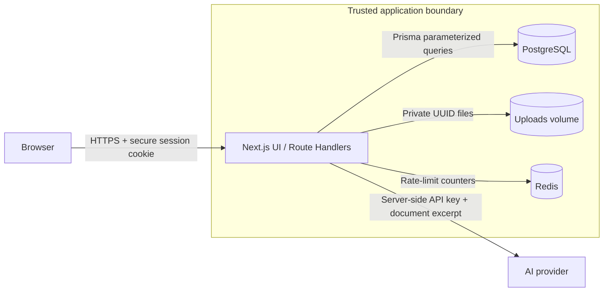

# DevSecOps Security Progress Report

## Project information

- **Project:** AI Study Companion (AI PDF Learning Platform)
- **Technology:** Next.js 16, NextAuth, Prisma, PostgreSQL, Redis, Docker, external AI providers
- **Review date:** 2026-09-08
- **Scope:** Authentication, authorization, PDF/Markdown upload, document access, AI endpoints, database access, secrets, and deployment configuration

## 1. System architecture and trust boundary



**Trust boundary:** Browser and AI providers are outside the application trust boundary. Every sensitive Route Handler must verify the session and document ownership on the server; hiding a menu in the UI is not considered authorization.

## 2. Important assets and attack surface

| Asset | Why it is important | Main attack surface | Existing control |
|---|---|---|---|
| User account and password hash | Prevent account takeover | Login, registration, credentials callback | bcrypt cost 12, failed-login counter, temporary lockout, `LoginLog` |
| Session/JWT | Determines the current user and role | Cookie, `/dashboard`, `/admin`, API endpoints | HttpOnly, SameSite=Lax, Secure in production, role checks |
| Private document and extracted text | May contain personal/academic data | Upload, `/api/files/[filename]`, AI and tools endpoints | UUID filenames, owner check, private `uploads/` directory, path containment |
| PostgreSQL data | Stores users, documents, messages, notes, quizzes and logs | Prisma API calls, database connection string | Prisma parameterized queries, foreign keys/cascades, `.env` secret |
| AI API key and AI budget | Prevent key leakage and unexpected cost | `/api/ai`, `/api/tools`, provider configuration | Server-side environment variables, request and output limits, Redis rate limiting |
| Admin functions | Access to cross-user overview and support data | `/admin`, `/api/admin/*` | `ADMIN` server-side guard and 403 response for students |

## 3. Risk scoring method

- **Likelihood (L):** 1 = rare, 5 = very likely
- **Impact (I):** 1 = negligible, 5 = severe privacy/security/business impact
- **Risk score:** `L × I`
- **Level:** 1–4 Low, 5–9 Medium, 10–14 High, 15–25 Critical
- Scores below are **inherent risk before the listed control is applied**. Status reflects the current source-code implementation as of the review date.

## 4. Risk register

| ID | Asset / Function | Threat or vulnerability | L | I | Score | Level | Mitigation / remediation | Status |
|---|---|---:|---:|---:|---:|---|---|---| 
| R01 | Login | Brute-force password guessing and account takeover | 4 | 4 | 16 | Critical | bcrypt password hash, failed-attempt counter, 30-second lockout after 5 failures, login log | Fixed in source; needs manual evidence |
| R02 | Document API | IDOR: changing a document filename/ID to view another user’s document | 4 | 5 | 20 | Critical | Session plus server-side `userId` ownership query on document/file/AI routes | Fixed in source; needs request/response evidence |
| R03 | File upload | Fake MIME type, dangerous content, or oversized upload | 4 | 5 | 20 | Critical | PDF signature `%PDF`, extension/MIME policy, 50 MB limit, request-size limit, reject invalid extraction | Partially fixed; no malware/AV scan yet |
| R04 | File storage | Path traversal such as `../package.json` to read/write outside uploads | 3 | 5 | 15 | Critical | UUID-only filename allowlist and resolved-path containment validation | Fixed in source and regression test |
| R05 | AI document processing | Prompt injection embedded in uploaded content changes AI behavior | 4 | 4 | 16 | Critical | Treat document as untrusted reference data, delimit document context, grounding rules, ownership checks | Mitigated; requires adversarial prompt test evidence |
| R06 | AI/upload endpoints | API cost exhaustion or denial of service | 4 | 4 | 16 | Critical | Per-user/network Redis rate limit and provider prompt/output limits | Fixed in source; needs Redis/429 evidence |
| R07 | Dependencies | Known vulnerable npm package is introduced or remains unpatched | 3 | 4 | 12 | High | Lockfile exists; CI build/lint exists | Open: add and retain `npm audit` report and dependency scanning in CI |
| R08 | Secrets and production configuration | Database/API keys/JWT secret exposed or production services misconfigured | 3 | 5 | 15 | Critical | `.env` ignored, server-only provider keys, production secure cookie, Docker binds DB/Redis to localhost | Partially fixed: use dedicated DB application user and secret scanning before deployment |

## 5. Vulnerability assessment and remediation evidence

### Implemented controls verified from source

| Finding | Source location | Remediation state |
|---|---|---|
| Weak password storage / brute force | `src/lib/auth.ts` | bcrypt verification, lockout, and `LoginLog` are implemented |
| Broken access control to Admin functions | `src/proxy.ts`, `src/app/api/admin/overview/route.ts`, `src/app/admin/page.tsx` | Unauthenticated requests return 401; Student requests return 403; admin page has server guard |
| Document path traversal | `src/lib/security.ts`, `src/app/api/files/[filename]/route.ts` | Stored filename must be UUID + approved extension; resolved files must remain under uploads root |
| Fake or oversized upload | `src/app/api/upload/route.ts`, `src/lib/upload-policy.ts` | PDF signature, MIME/extension policy, and 50 MB request/file limits are checked |
| SQL injection | Prisma Route Handlers and `prisma/schema.prisma` | ORM/parameterized queries are used; no raw SQL was found in the reviewed application routes |
| AI abuse | `src/proxy.ts`, `src/lib/rate-limit.ts`, `src/lib/ai-provider.ts` | Redis rate limiting and provider output limits are implemented |

### Current automated verification result

| Command | Result | Note |
|---|---|---|
| `bun run lint` | Passed | ESLint completed with no reported violation |
| `bun run test` | **9 passed / 1 failed** | The failed test expects literal English menu labels (`Admin Console`/`Student Overview`), but the Navbar now uses i18n keys. RBAC code is present, but the regression test must be updated before claiming a fully green suite. |
| `tests/security.test.ts` | Partially passed | Path traversal, size-limit classification, rate limit, unsafe retention, and provider wiring tests passed; the i18n-related RBAC assertion failed |

## 6. Before/After evidence plan

The assignment requires at least two before/after demonstrations. The code remediation exists, but the repository does **not yet contain** a complete `evidence/before-after/` directory. Capture and commit the following after running the tests in a controlled local/staging environment:

1. **R02 - Admin authorization**
   - Before: Student requests `GET /api/admin/overview` without a server-side role guard and sees data / non-403 behavior.
   - After: Student request returns `403 Forbidden`; Admin request returns `200`.
2. **R03 - File upload validation**
   - Before: Show the attempted upload request.
   - After: `.exe`, fake PDF MIME/signature, and a file over 50 MB are rejected with `400` or `413`.
3. **R04 - Path traversal**
   - Before: Show the attack payload `../package.json`.
   - After: API rejects unsafe filename; automated regression test passes.
4. **R06 - Rate limit**
   - Before: Repeated requests can consume provider quota.
   - After: request 11 in a one-minute test window returns `429 Too Many Requests`.

> Do not manufacture a vulnerable production version. “Before” evidence may be a code-review finding, a safe test fixture, or a controlled local branch; it must clearly identify the original risk and the final verification result.

## 7. Security tools and DevSecOps cycle

The project has a GitHub Actions workflow and automated Node tests, but the required evidence from at least three security tools is not yet committed. The following are required next steps.

| Tool / technology | Detect | Analyze | Fix / verify | Current status |
|---|---|---|---|---|
| OWASP ZAP | Missing headers, exposed endpoints, common web issues | Review alert risk and affected URL | Add/adjust header or authorization control; rerun scan | Workflow exists but is not runnable yet: app is not started and `.zap/rules.tsv` is missing |
| Semgrep | Insecure patterns in source | Review finding path and severity | Patch code and save post-fix report | Not started |
| `npm audit --omit=dev` | Vulnerable production packages | Review package/advisory and exploitability | Upgrade/replace package and rerun audit | Not started / no report committed |
| Trivy | Vulnerable Docker image/dependencies | Review image/package CVEs | Update base image/dependency and rerun scan | Not started |
| Application validation / RBAC tests | Authorization, traversal, upload and rate-limit regressions | Read failed/passed test output | Fix tests/code, rerun suite | Implemented; one stale i18n assertion remains |

## 8. Required evidence repository structure

```text
SECURITY_PROGRESS.md
evidence/
  zap/
    baseline-before.html
    baseline-after.html
  sast/
    semgrep-before.json
    semgrep-after.json
  dependency/
    npm-audit-before.json
    npm-audit-after.json
  container/
    trivy-before.txt
    trivy-after.txt
  database/
    least-privilege-role.sql
  before-after/
    r02-admin-403.png
    r03-upload-rejection.png
    r04-path-traversal-test.txt
    r06-rate-limit-429.png
```

## 9. Outstanding work before submission

1. Update the RBAC regression assertion to test role behavior/i18n keys instead of a hard-coded English label; rerun until all tests pass.
2. Run and save reports for at least three real security tools, with a detect → analyze → fix → verify record for each.
3. Repair GitHub Actions DAST: run a test application before ZAP, add the missing rules file, and archive scan artifacts.
4. Add before/after evidence for at least two mitigations.
5. Use a non-superuser PostgreSQL application role for production, then record least-privilege verification.
6. Record a 5–8 minute demo: real app → tool output → risk → code/config fix → repeat verification.
7. Keep this report, evidence, and the source/configuration changes in Git history.

## 10. Submission readiness

| Requirement | Status |
|---|---|
| Architecture, assets, attack surface | Ready |
| Risk register with 5–8 scored risks | Ready |
| Source-code mitigations | Ready / partially verified |
| Automated security regression tests | Needs one test fix |
| Three real security-tool reports | Not ready |
| Before/after evidence | Not ready |
| Evidence directory in Git | Not ready |
| Demo video | Not ready |

**Conclusion:** The core application security controls are implemented in source. The remaining work is chiefly evidence collection, CI security-tool integration, the stale RBAC test update, and production database hardening.
