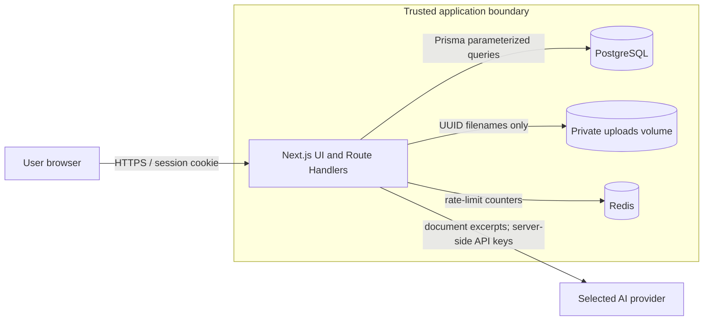
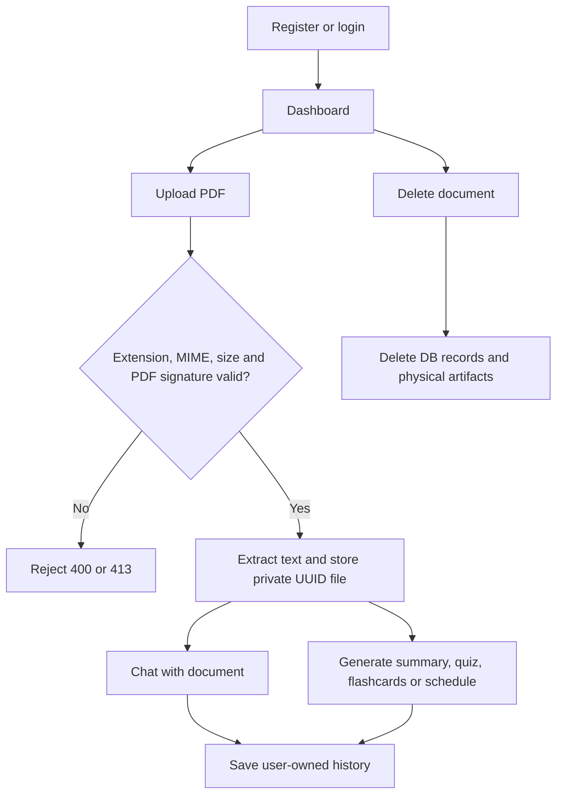
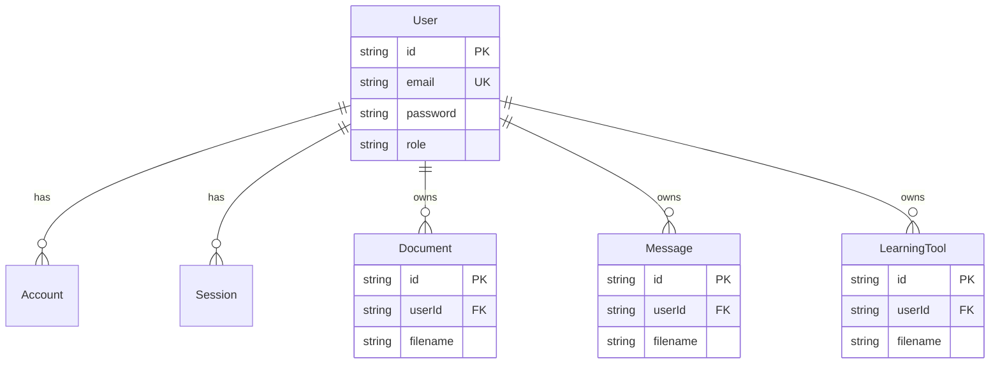

# AI Study Companion — Architecture and Security

Last reviewed: 2026-08-23

## System architecture and trust boundaries

The browser and AI providers are outside the trusted application boundary. Route Handlers recheck authentication and ownership close to PostgreSQL and the uploads volume. Proxy checks are only an early guard and are not the sole authorization layer.

## Main user flow

## Use cases and access control

| Actor | Use case | Required control |
|---|---|---|
| Visitor | Register and login | Server validation, bcrypt, persistent failed-login lockout |
| Student | Upload/read/rename/delete own PDF | Authenticated session plus owner check |
| Student | Chat and create learning tools | Owner check, Redis rate limit, provider cost limit |
| Admin | Support access to documents | `ADMIN` role from the database; no magic user ID or password |
| System | Call external AI provider | API keys stay server-side; document is marked as untrusted data |

## Database overview

`Document.userId`, `Message.userId`, and `LearningTool.userId` reference `User.id` with cascade deletion. Document-related records currently share the protected UUID filename; a future migration should add a direct `documentId` foreign key for stronger referential integrity.

## Important API endpoints

| Method | Endpoint | Purpose | Access |
|---|---|---|---|
| POST | `/api/auth/register` | Register | Public |
| POST | `/api/auth/callback/credentials` | Login | Public; lockout enforced |
| POST | `/api/upload` | Upload PDF | Authenticated |
| GET | `/api/files` | List own documents | Authenticated |
| GET/PATCH/DELETE | `/api/files/[filename]` | Read/rename/delete document | Owner or Admin |
| POST | `/api/ai` | Streaming grounded chat | Document owner |
| POST | `/api/tools` | Summary/quiz/flashcards/schedule | Document owner |
| GET | `/api/messages` | Conversation history | Authenticated owner |
| GET | `/api/ai/providers` | Available configured providers | Authenticated |

## Secure SDLC controls

| Stage | Control and evidence |
|---|---|
| Requirement | PDF only, 10MB maximum, owner-only access, private storage, deletion and AI privacy requirements |
| Design | Trust boundaries above; role and ownership checks at Route Handlers; Redis rate limiting |
| Development | bcrypt, Prisma, UUID allowlist, resolved-path containment, server validation, `.env` secrets |
| Testing | `npm test`, `npm run lint`, `npm run build`, `npm audit --omit=dev`, manual upload/auth tests |
| Deployment | non-default required auth/admin secrets, localhost-only DB/Redis ports, non-public uploads volume |
| Maintenance | access/login logs, dependency audit, quarterly patch review, incident response below |

## STRIDE threat model and risk register

| Asset | Threat | Control | Verification |
|---|---|---|---|
| Login | Spoofing/brute force | bcrypt, per-account lockout, no hardcoded bypass | wrong-password and static regression tests |
| File API | Tampering/path traversal | UUID allowlist plus resolved path containment | traversal variants in `tests/security.test.ts` |
| Documents | Information disclosure | owner checks, private volume, uploads ignored by Git | unauthorized request and `git ls-files uploads` |
| Delete | Repudiation/privacy retention | delete DB children and physical PDF/text/index | deletion integration test/manual check |
| AI API | DoS/cost exhaustion | Redis per-user/path rate limit | request 11 returns 429 |
| Document prompt | Elevation/prompt injection | document delimited as untrusted reference; system rules require grounding | adversarial document test |
| UI rendering | XSS | React text rendering and Mermaid strict security mode | script payload renders as text |

## Incident response

1. Disable the affected provider or endpoint and preserve security logs without secrets.
2. Rotate affected API keys, `NEXTAUTH_SECRET`, and credentials.
3. Identify impacted user/document IDs and delete exposed private artifacts.
4. Patch and run the complete security regression suite.
5. Notify affected users with scope, dates, data categories, and remediation.
6. Record root cause and add a regression test before re-enabling the service.

